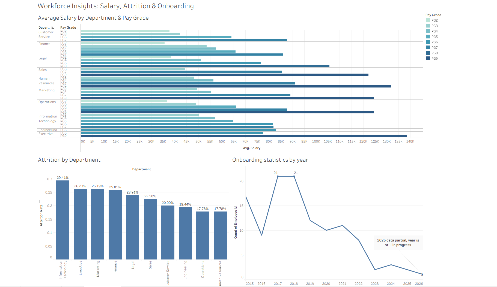

# Workforce Insights: Salary, Attrition & Onboarding
### An HR Payroll Data Cleaning & Visualization Project by Renfred Joshua Armoo



**[View the interactive dashboard on Tableau Public →](https://public.tableau.com/app/profile/renfred.armoo/vizzes)**

## Project Highlights

- Cleaned and standardized a 500-record HR payroll dataset in MySQL,
  resolving duplicate records, inconsistent date/salary formats, and data
  entry errors to produce an analysis-ready dataset
- Wrote SQL transformations (regex-based date parsing, numeric casting,
  deduplication logic) to consolidate 6+ inconsistent data formats into a
  single standardized schema
- Applied transaction-safe SQL practices (`START TRANSACTION` /
  verification / `COMMIT`) to prevent data loss during destructive
  operations on live records
- Built an interactive Tableau dashboard analyzing salary equity,
  attrition, and hiring trends across 10 departments, surfacing a 29.4%
  attrition rate in the highest-turnover department
- Identified and corrected a data visualization error (incorrectly stacked
  salary averages) that would have misrepresented compensation figures to
  stakeholders
- Made and documented data-integrity tradeoffs (e.g., excluding incomplete
  pay-grade records rather than estimating) to keep analysis outputs
  accurate and defensible

## Overview

This project simulates a real-world HR analytics workflow from a large-sized
technology organization: cleaning messy, inconsistently formatted payroll
data for 500 employees and fine-tuning it for analysis. The goal was to
demonstrate my ability to clean messy data and translate the clean data into
findings for visualization that will help with leadership decision-making.

**Questions this project sought to answer:**
1. How does the average salary vary by pay grade and department? Is
   compensation applied consistently, or are there discrepancies worth
   further investigation?
2. Which department has the highest attrition, and how does it compare
   company-wide?
3. What does the company's onboarding trend look like over time?

## Data Cleaning (SQL / MySQL)

The raw dataset arrives with various inconsistencies typical of real payroll
exports pulled from multiple systems or entered manually:

- **Duplicate records** — some employees appeared more than once, with
  identical data
- **Inconsistent name formatting** — mixed casing, leading/trailing
  whitespace
- **Non-standard department names** — case and spelling variants
  ("marketing", "MARKETING", "Marketing ")
- **Salary stored in mixed format** — some values are plain numbers, others
  have dollar signs, commas, or trailing decimals
- **Pay grade inconsistencies** — formatting variants like `PG6`, `pg6`, and
  `PG-6`, when they all refer to the same pay grade
- **Different date formats** across start/termination dates
- **Logic errors** — some employees had termination dates earlier than
  start dates
- **Job type abbreviations and casing variants** (`FT`, `Full Time`,
  `FULL-TIME`, `Full-Time`)
- **Missing or incorrect work emails**

I deliberately left 21 records untouched to ensure data integrity; these
records had no pay grade in the source data, and instead of estimating,
they were left `NULL` and excluded from pay grade analysis.

## Key Findings

**Salary & Pay Grade**
Average salary is largely consistent within each pay grade across
departments; for example, employees who are PG7 earn $85K–$94K regardless
of the department they work in. This shows that the pay grade structure is
applied fairly rather than varying by department. Note that PG8 consists of
only four employees, all working in the Legal department, so that average
is a small sample and shouldn't be treated with the same level of
confidence as the other grades.

**Attrition**
The IT department has the highest attrition rate in the company at 29.4%,
followed by Executive at 26.2% and Marketing at 26.2%. The lowest attrition
rate is in both Operations and HR, at around 17.8%. The IT department's
attrition is a particular concern because those roles tend to be highly
specialized and hard to replace, and the hiring/ramp-up costs for those
positions can be expensive.

**Onboarding**
Hiring peaked in 2017–2018, with 21 new hires each year, with a marked
slowdown from 2023 onward. It's worth noting that the 2026 figures are
partial, since the year was still ongoing when the data was pulled — this
is visible as an apparent drop at the end of the trend line, reflecting the
incomplete year, and is annotated accordingly on the dashboard.

## Tools

- **MySQL** — data cleaning, transformation, and validation
- **Tableau** — dashboard and visualization
- **Dataset** — self-contained simulated HR payroll data, 500 records

## What I'd Do Differently / Lessons Learned

- Wrapping every destructive SQL operation in `START TRANSACTION` with a
  verification step before `COMMIT` should be the default habit, not an
  afterthought — an early dedup mistake (deleting 15 rows instead of the
  intended 8) was a direct result of skipping this the first time.
- Averages should never be stacked in a bar chart — an early version of the
  salary visualization stacked `AVG(Salary)` by pay grade, which produced
  bar totals with no real meaning. Caught by sanity-checking the chart
  against expected magnitude, not by trusting the visual at face value.
- Choosing to leave the 21 missing pay grades as `NULL` rather than
  imputing them was a judgment call favoring data integrity over a
  "complete-looking" chart — a distinction worth being explicit about
  rather than letting a viewer assume the dataset is fully populated.

## Repo Contents

```
├── README.md                          ← this file
├── data/
│   └── hr_payroll_data1.csv           ← the original, uncleaned dataset
├── sql/
│   └── hr_payroll_portfolio.sql       ← full cleaning script (MySQL)
└── screenshots/
    └── dashboard.png                  ← dashboard preview image
```
